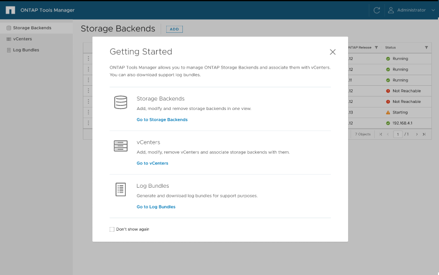

= Benutzeroberfläche von ONTAP Tools Manager
:allow-uri-read: 
:icons: font
:imagesdir: ../media/

[role="lead"]
ONTAP Tools für VMware vSphere 10.0 ist ein mandantenfähiges System, das mehrere vCenter managt. Ein Administrator muss die vCenters, die gemanagt werden, und das Storage Back-Ends, besser kontrollieren können.

Der ONTAP Tools Manager bietet Administratoren von ONTAP Tools mehr Kontrolle und Power, was das allgemeine Management der Appliance, Mandanten und Storage-Back-Ends erleichtert.

Die ONTAP-Tools bieten folgende Leistungen:

* VCenter Management – Registrieren Sie sich und heben Sie die Registrierung von vCenter für die ONTAP Tools auf
* Storage-Back-End-Management – Registrieren Sie ONTAP Storage Cluster und heben Sie sie zu ONTAP Tools auf und ordnen Sie sie den global eingegliedert Storage Centern zu.
+
Das Storage-Back-End ist global, wenn es vom ONTAP Tools Manager oder von Commons-APIs hinzugefügt wird, und sie werden lokal, wenn sie von den vCenter APIs hinzugefügt werden.
Beispiel: Für eine mandantenfähige Einrichtung können Sie ein Storage-Back-End (Cluster) global und eine lokale SVM hinzufügen, um direkte SVM-Anmeldedaten zu verwenden.

* Download von Protokollpaketen

Um auf die UI der ONTAP-Tools zuzugreifen, starten Sie `\https://loadBalanceIP:8443/virtualization/ui/` Über den Browser und melden Sie sich mit den Administratoranmeldeinformationen von ONTAP Tools an, die während der Bereitstellung angegeben wurden.

Sie können die Option *nicht mehr anzeigen* auswählen, um dieses Popup-Fenster nicht zu sehen, wenn Sie sich erneut über denselben Browser anmelden.
